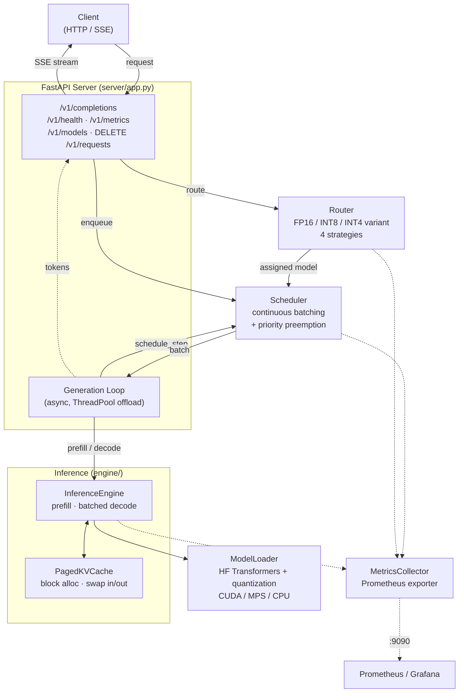

# LiteServe

A lightweight LLM inference serving engine — continuous batching, paged KV-cache, quantization, and multi-model routing in ~2,500 lines of readable Python.

LiteServe implements the core ideas behind production inference servers like vLLM and TGI (PagedAttention-style memory management, continuous batching, dynamic routing) in a compact, dependency-light codebase you can actually read end to end. It ships with an OpenAI-style HTTP API, SSE token streaming, Prometheus metrics, and a Grafana dashboard.

> **Why it exists:** most inference servers are fast but opaque. LiteServe is built to be *legible* — every component (scheduler, KV-cache, router, engine) is a small, self-contained module you can study, modify, and benchmark.

---

## Features

- **Continuous batching** — requests join and leave the running batch every decode step, instead of waiting for the whole batch to finish. All in-flight decode steps run in a *single* padded forward pass (left-padded KV + attention mask + per-request position ids), so throughput scales with batch size while staying bit-for-bit equivalent to decoding each request alone. Keeps the GPU saturated under mixed load.
- **Paged KV-cache** — vLLM-style block allocation. KV memory is split into fixed-size blocks allocated on demand, with CPU swap-out/swap-in for preempted requests instead of dropping them.
- **Priority preemption** — high-priority requests can preempt (swap out) lower-priority ones when memory is tight, then resume them when space frees up.
- **Multi-model routing** — route each request to an FP16 / INT8 / INT4 variant based on GPU load, queue depth, and priority. Four strategies: `quality_first`, `throughput_first`, `priority`, `adaptive`.
- **Quantization** — INT8 and INT4 via bitsandbytes, plus pre-quantized GPTQ models, with automatic FP16 fallback.
- **Streaming API** — FastAPI server with Server-Sent Events token streaming, an OpenAI-style `/v1/completions` endpoint, plus health, metrics, model listing, and request abort.
- **Observability** — Prometheus metrics (throughput, TTFT, ITL, queue depth, KV-cache utilization, preemptions, routing decisions) and a ready-made Grafana dashboard.
- **Runs anywhere** — auto-detects CUDA / Apple MPS / CPU. Use the TinyLlama config to develop on a laptop, switch to the GPU config for real workloads.

---

## Architecture



### Request lifecycle

1. **Receive** — a request hits `POST /v1/completions`.
2. **Route** — the [Router](liteserve/router/router.py) picks a model variant (FP16/INT8/INT4) from current GPU utilization, queue depth, and request priority.
3. **Schedule** — the request enters the [Scheduler](liteserve/scheduler/scheduler.py)'s pending queue. The async generation loop forms a batch every step, admitting requests while KV-cache blocks are available and preempting low-priority work when high-priority requests need memory.
4. **Infer** — the [InferenceEngine](liteserve/engine/inference.py) prefills new requests, then decodes every in-flight request together in one batched forward pass, tracking per-request KV state. Blocking GPU work runs in a thread pool so the event loop stays responsive for streaming.
5. **Stream** — generated tokens are streamed back over SSE as they're produced; metrics are recorded throughout.

### Components

| Module | Responsibility |
|---|---|
| [engine/kv_cache.py](liteserve/engine/kv_cache.py) | Paged KV-cache: block-based allocation, ref-counted blocks, CPU swap space |
| [scheduler/scheduler.py](liteserve/scheduler/scheduler.py) | Continuous batching loop, memory budgeting, priority preemption, timeout admission |
| [router/router.py](liteserve/router/router.py) | Adaptive multi-model routing across quantization variants |
| [engine/inference.py](liteserve/engine/inference.py) | Prefill + batched decode forward passes, sampling, per-request KV tracking |
| [models/loader.py](liteserve/models/loader.py) | Model loading with INT8/INT4 quantization, device auto-detection |
| [server/app.py](liteserve/server/app.py) | FastAPI app, SSE streaming, request lifecycle orchestration |
| [metrics/collector.py](liteserve/metrics/collector.py) | Prometheus metrics + GPU stats |

---

## Quickstart

### Install

```bash
git clone https://github.com/vinu008/LiteServe.git
cd LiteServe
python3 -m venv .venv && source .venv/bin/activate
pip install -e ".[dev]"
```

Or run the setup script, which installs dependencies and runs the test suite:

```bash
./scripts/setup.sh
```

### Validate the pipeline (no server needed)

Loads a small model and generates text end to end. Defaults to TinyLlama-1.1B so it runs on CPU/MPS/any GPU:

```bash
python scripts/validate.py
```

### Run the server

```bash
# Laptop / CPU / MPS — TinyLlama 1.1B
python -m liteserve.server.app --config configs/local.yaml

# GPU — Mistral 7B (see configs/gpu.yaml)
python -m liteserve.server.app --config configs/gpu.yaml
```

### Send a request

```bash
# Streaming (default)
python scripts/send_request.py "Explain continuous batching in one paragraph."

# Or with curl, non-streaming
curl -X POST http://localhost:8000/v1/completions \
  -H "Content-Type: application/json" \
  -d '{"prompt": "Hello, world", "max_tokens": 64, "stream": false}'
```

---

## API

| Method | Endpoint | Description |
|---|---|---|
| `POST` | `/v1/completions` | Generate a completion (SSE stream or JSON). |
| `GET` | `/v1/health` | Health, loaded models, GPU + scheduler stats. |
| `GET` | `/v1/metrics` | JSON metrics summary (scheduler, router, engines). |
| `GET` | `/v1/models` | List loaded model variants. |
| `DELETE` | `/v1/requests/{id}` | Abort an in-flight request. |

**Completion request fields:** `prompt`, `max_tokens` (1–4096), `temperature` (0–2), `stream` (bool), `priority` (`normal`\|`high`), `model_preference` (`auto`\|`fp16`\|`int8`\|`int4`).

Prometheus metrics are exposed separately on port `9090` (configurable).

---

## Configuration

Configs are YAML ([configs/](configs/)). Pick a model set, scheduler limits, router strategy, and KV-cache block size:

```yaml
models:
  - name: "mistral-fp16"
    path: "mistralai/Mistral-7B-v0.1"
    quantization: null          # null = FP16, or "int8", "int4-bnb", "int4-gptq"
    default: true

scheduler:
  max_batch_size: 32
  max_waiting_time_ms: 100
  preemption_policy: "fcfs"     # "fcfs" or "priority"

router:
  strategy: "adaptive"          # quality_first | throughput_first | priority | adaptive
  gpu_util_high_threshold: 0.85
  queue_depth_threshold: 20

kv_cache:
  block_size: 16
```

Provided configs: [local.yaml](configs/local.yaml) (TinyLlama, CPU/MPS), [gpu.yaml](configs/gpu.yaml) (Mistral 7B + optional quantized variants), [default.yaml](configs/default.yaml) (Llama 2 7B).

---

## Benchmarks

LiteServe ships three benchmark tools:

- **[scripts/verify_batching.py](scripts/verify_batching.py)** — proves batched decode is *correct* (identical greedy tokens to per-request decode) and measures the throughput speedup. Run this first.
- **[scripts/benchmark_comparison.py](scripts/benchmark_comparison.py)** — sequential vs. continuous batching throughput (runs the engine directly, no HTTP), reports the speedup multiplier, TTFT, and latency.
- **[benchmarks/benchmark.py](benchmarks/benchmark.py)** — full HTTP load test across concurrency levels: throughput (tok/s), requests/s, latency p50/p95/p99, TTFT, and inter-token latency.

### Results

**Continuous batching delivers a real throughput multiplier** because all in-flight decode steps share one forward pass. The effect grows on a GPU (more idle compute to recover at batch size 1) and with larger models.

Verified locally on **Apple M-series (MPS), TinyLlama-1.1B**, 8 concurrent requests — batched decode produces *identical* greedy output to the sequential baseline:

| Mode | Throughput (tok/s) | Speedup |
|---|---|---|
| Sequential baseline | ~20 | 1.0× |
| Continuous batching | ~72 | **~3.5×** |

> Reproduce: `python scripts/verify_batching.py --requests 8`

#### On a GPU (run the Colab notebook to fill in)

The repo includes a ready-to-run notebook — **[benchmarks/colab_benchmark.ipynb](benchmarks/colab_benchmark.ipynb)**. Open it in Colab (`Runtime → Change runtime type → T4 GPU`) and `Run all`; it clones the repo, installs deps, runs all three benchmarks against a 7B model, and prints copy-paste-ready tables for the cells below.

**Continuous batching vs. sequential** — _NVIDIA T4 (16 GB), Mistral-7B, 128 tokens_ (run the notebook):

| Mode | Throughput (tok/s) | Speedup |
|---|---|---|
| Sequential baseline | _run notebook_ | 1.0× |
| Continuous batching | _run notebook_ | **_run notebook_** |

**HTTP load test** (`benchmark.py`):

| Concurrency | Throughput (tok/s) | Req/s | Latency p50 / p95 / p99 (ms) | TTFT p50 (ms) |
|---|---|---|---|---|
| 1 | _run notebook_ | | | |
| 4 | _run notebook_ | | | |
| 8 | _run notebook_ | | | |

To run locally instead:

```bash
# Prove correctness + measure the batching speedup
python scripts/verify_batching.py --requests 8

# Sequential vs. continuous batching throughput
python scripts/benchmark_comparison.py --model mistralai/Mistral-7B-v0.1 --num-requests 8

# HTTP load test (server must be running)
python benchmarks/benchmark.py --url http://localhost:8000 --concurrency 1 4 8
```

---

## Observability

`docker-compose up` brings up LiteServe, Prometheus, and Grafana together:

```bash
docker-compose up
```

- LiteServe API → `http://localhost:8000`
- Prometheus → `http://localhost:9091`
- Grafana → `http://localhost:3000` (admin / `liteserve`), with the [LiteServe dashboard](dashboards/liteserve-dashboard.json) preloaded

Tracked metrics include tokens/sec, TTFT and inter-token latency histograms, batch size, queue depth, KV-cache utilization, preemptions, and per-variant routing decisions.

---

## Docker

```bash
# Build and run the server (CUDA image)
docker build -t liteserve .
docker run --gpus all -p 8000:8000 -p 9090:9090 \
  -e HUGGING_FACE_HUB_TOKEN=$HF_TOKEN liteserve
```

See [Dockerfile](Dockerfile) and [docker-compose.yml](docker-compose.yml).

---

## Project structure

```
liteserve/
├── engine/          # inference engine, paged KV-cache, core types
├── scheduler/       # continuous batching scheduler + preemption
├── router/          # multi-model adaptive router
├── models/          # model loading + quantization
├── server/          # FastAPI app + SSE streaming
└── metrics/         # Prometheus collector
benchmarks/          # load test + Colab notebook
scripts/             # validate, send requests, benchmarks, perplexity eval
configs/             # local / gpu / default YAML configs
dashboards/          # Grafana dashboard
tests/               # 55 unit tests
```

---

## Testing

```bash
pytest                              # 55 fast unit tests (config, types, KV-cache, scheduler, router, metrics)
LITESERVE_MODEL_TESTS=1 pytest      # also run batched-decode correctness tests (downloads TinyLlama)
```

---

## License

[MIT](LICENSE) © 2026 Vivek Inumella
